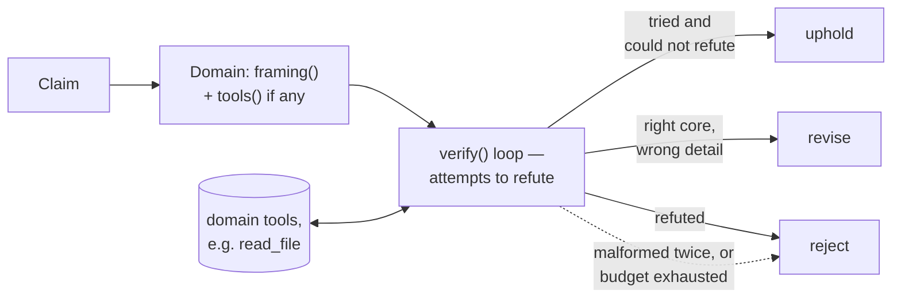

# elenchus

> ἔλεγχος (élenkhos): the Socratic method of testing a claim by trying, in
> good faith, to refute it.

[](https://github.com/Vincent-P-essy/elenchus/actions/workflows/ci.yml)
[](https://github.com/Vincent-P-essy/elenchus/blob/main/pyproject.toml)
[](https://github.com/Vincent-P-essy/elenchus/blob/main/pyproject.toml)
[](https://github.com/astral-sh/ruff)
[](LICENSE)

A claim isn't true because a model said it. Elenchus pairs any LLM claim
with an independent adversarial verifier that tries to refute it before
it's trusted — and measures, empirically, when that actually helps.

## Where this came from

The same shape kept showing up in three unrelated projects: a code
reviewer's verifier double-checking a proposed finding, a game's narrator
proposing a quest that a deterministic engine alone gets to grant, a
tutor's question generator whose output gets validated before a learner
ever sees it. In every case an LLM *proposes*, and something else — a
second adversarial pass, or a hard deterministic check — *decides*. Once
that pattern shows up a third time it stops being a coincidence and starts
being a library.

Elenchus is that pattern, pulled out of a single specific application (code
review) and generalized to any domain: give it a `Claim` (an assertion plus
whatever context is available) and a `Domain` (what this kind of claim
tends to get wrong, plus optional tools to go check), and it runs an
adversarial loop that ends in exactly one of three verdicts —
**uphold**, **revise**, or **reject** — never silence, never a hang.

## How it works



- **Tool calls run until the model calls `submit_verdict`**, which is
  force-invoked on the final loop iteration — a run always terminates with
  a structured result, never an unbounded agent loop.
- **A malformed verdict gets one repair attempt** (a tool-error bounce back
  to the model); a second failure, or an exhausted budget, defaults to
  **reject**. Precision is the fallback, not the exception.
- **Domains are three methods**: `framing()` (what this kind of claim looks
  like, in prose), `tools()` (an Anthropic tool schema list, empty if the
  claim's context is already self-contained), and `run_tool()` (dispatch).
  Three ship built in — `code` (reads files from an in-memory repo, mirrors
  how [momus](https://github.com/Vincent-P-essy/momus)'s verifier actually
  works), `math`, and `reading` — and a fourth is a `Domain`-shaped
  dataclass away.

## Quickstart

```sh
pip install git+https://github.com/Vincent-P-essy/elenchus
export ANTHROPIC_API_KEY=sk-ant-...

elenchus verify-claim --domain math \
  --assertion "51 is a prime number." \
  --context "Determine whether 51 is prime."
# verdict: reject
# rebuttal: The claim is factually wrong. 51 = 3 x 17, so it has divisors
#           other than 1 and itself, making it composite, not prime.
# cost: $0.0106
```

```python
from elenchus.claim import Claim
from elenchus.domains import CodeDomain
from elenchus.llm import AnthropicLLM, UsageTally
from elenchus.verifier import verify

tally = UsageTally()
llm = AnthropicLLM(tally=tally)
domain = CodeDomain(files={"tags.py": "def add_tag(item, tag, tags=[]):\n    ..."})
claim = Claim(
    id="c1", domain="code",
    assertion="add_tag has a mutable default argument bug.",
    context="See tags.py.",
)
result = verify(llm, domain, claim)
print(result.verdict, result.rebuttal)
```

## The benchmark

A verifier you can't measure is a verifier you can't trust. `bench/cases/`
holds 30 hand-authored claims across the three domains — deliberately not
LLM-generated, so the ground truth is controlled and the benchmark measures
the verifier's own discriminative power rather than conflating it with how
good some upstream proposer is at phrasing claims. Roughly half of each
domain pairs a real, planted defect with a claim that correctly names it;
the other half pairs a superficially identical but actually-safe case with
a claim that wrongly accuses it of the same thing — the near-miss is the
point. A few cases are neither clearly true nor false: the core of the
claim is right but a detail, scope, or number is wrong, which is exactly
what **revise** exists for (`51 is prime` is a **reject**; `3.14 is the
exact value of pi` is a **revise** — the approximation is fine, "exact" is
the error).

```sh
uv run elenchus bench                       # full run, writes bench-report.md
uv run elenchus bench --domain code         # one domain
uv run elenchus bench --model claude-sonnet-5
```

Two numbers matter, kept deliberately distinct:

- **accept precision/recall** — of the claims elenchus decided to trust
  (uphold or revise), how many deserved it, and of the claims that
  deserved trust, how many did it actually keep. This is the
  decision-relevant number: it's what "would this have let something false
  through" means in practice.
- **exact-verdict match** — the stricter bar of also picking the *right*
  one of the three verdicts, not just the accept/reject boundary.

### Latest results

Run in CI on 2026-07-18 — `claude-opus-4-8`, 30 cases, no cherry-picking
(the workflow that produced this is
[`.github/workflows/bench.yml`](.github/workflows/bench.yml)):

| metric | value |
|---|---|
| baseline accuracy (trust every claim as-is) | 47% |
| accept precision | **0.94** |
| accept recall | **0.94** |
| accept F1 | **0.94** |
| exact-verdict match | 93% |
| total cost, 30 cases | **$0.51** ($0.017/case, ~7s/case) |

| domain | n | baseline acc. | precision | recall | F1 | exact match |
|---|---|---|---|---|---|---|
| code | 10 | 50% | 0.86 | 1.00 | 0.92 | 90% |
| math | 10 | 50% | 1.00 | 0.83 | 0.91 | 90% |
| reading | 10 | 40% | 1.00 | 1.00 | 1.00 | 100% |

Baseline accuracy sits near 50% by construction — that's the point of
pairing each real defect with a matched near-miss, so "trust everything"
scores like a coin flip and any lift is attributable to the verification
step itself, not to the cases being easy.

Two misses out of 30, and both are worth reading rather than hiding:

- **math-10** (`3.14 is the exact value of pi`) was labelled **revise**
  (the approximation is fine, "exact" is the error); the verifier said
  **reject** outright. Defensible either way — it's a genuine calibration
  question about how much charity "revise" owes a claim, not a factual
  miss.
- **code-06** was labelled **reject** (the code compares two
  timezone-aware datetimes, so no naive/aware mismatch *as shown*); the
  verifier said **revise**, pointing out the claim assumes the caller
  always passes a naive `expires_at`, which the file itself never
  guarantees. That's a sharper read of the claim's own wording than the
  label gave it credit for — a reminder that hand-authored ground truth
  has a point of view too.

Full per-case output, including both misses' complete rebuttals: the
`bench-report` artifact on that [workflow
run](https://github.com/Vincent-P-essy/elenchus/actions/workflows/bench.yml).

## Design decisions

- **Reject by default.** A run that can't reach a clean verdict — malformed
  output twice, an exhausted iteration budget, an LLM error — resolves to
  reject. A wrongly withheld true claim costs less than a wrongly trusted
  false one.
- **The model never touches raw SDK objects.** Requests and turns are
  small local types behind an `LLMClient` protocol, so the verifier and
  every domain are tested offline with a scripted model — 62 tests, zero
  network, and each `LLMRequest` is handed a snapshot of the conversation
  rather than a live reference into it, so a client that logs requests for
  debugging (like the test suite's own fake) sees exactly what was sent at
  the time, not the final state of the whole run.
- **Ground truth that isn't LLM-generated.** Benchmarking a claim-checker
  against claims an LLM invented risks measuring "does it agree with
  itself" rather than "is it right." Every case here is hand-authored,
  paired with a near-miss, and dated.
- **Three domains, one interface.** `Domain` is three methods. `math` and
  `reading` prove the library works with zero tools — a single model call,
  no agent loop — before `code` proves it also works with one.

## Limits

- 30 cases is directional, not a statistically powered benchmark — enough
  to catch a regression, not enough to report a confidence interval on.
- The ground truth was authored by the same person who built the verifier
  being measured against it; the near-miss pairing is the main defense
  against that bias, not a complete one (see code-06 above).
- Verification isn't free: ~$0.017 and ~7 seconds per claim on average in
  the benchmark above, more for domains that need a tool round-trip. For a
  claim that's cheap to be wrong about, that overhead may not be worth
  paying.
- It catches what a second careful reading catches. A claim that's wrong in
  a way that requires evidence outside the domain's tools or context will
  still slip through.

## Development

```sh
uv sync                                       # deps + editable install
uv run pytest -q --cov=elenchus               # 62 offline tests, 91% coverage
uv run ruff check . && uv run mypy            # lint + strict types
uv run elenchus verify-claim --domain reading --assertion "..." --context "..."
```

PRs to this repository are reviewed by
[momus](https://github.com/Vincent-P-essy/momus) itself (see
[`.github/workflows/momus.yml`](.github/workflows/momus.yml)) — the same
uphold/revise/reject verdict this library generalized, still running its
original job.

## License

[MIT](LICENSE) — © Vincent Plessy
